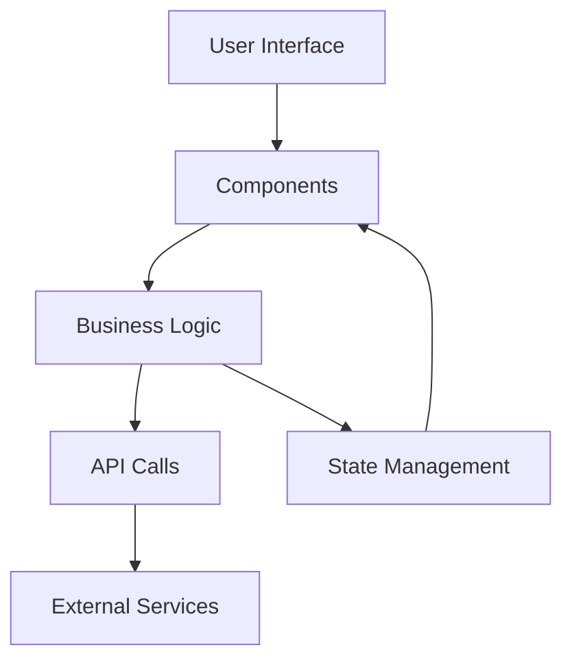

# Architecture Documentation

## System Overview

Map Action Dashboard is built using a modern React-based architecture, emphasizing modularity, reusability, and maintainability.

## Project Structure

```
Dashboard/
├── src/
│   ├── assets/          # Static resources
│   ├── components/      # Reusable UI components
│   ├── Fonctions/       # Core business logic
│   ├── layouts/         # Page layouts
│   ├── theme/          # UI theming
│   ├── variables/      # Configuration
│   └── views/          # Main application views
```

## Core Components

### Component Architecture

1. **Card Components**

    ```
    components/Card/
    ├── Card.js
    ├── CardBody.js
    └── CardHeader.js
    ```

    - Reusable card containers
    - Consistent styling across the application
    - Modular structure for flexibility

2. **Chart Components**

    ```
    components/Charts/
    ├── BarChart.js
    ├── Chart_zone.js
    └── LineChart.js
    ```

    - Built with ApexCharts.js
    - Data visualization components
    - Responsive design

3. **Navigation Components**
    ```
    components/Navbars/
    ├── Searchbar/
    ├── AdminNavbar.js
    ├── AdminNavbarLinks.js
    └── AuthNavbar.js
    ```
    - Role-based navigation
    - Search functionality
    - Authentication-aware components

## Core Functions

### Business Logic Layer

Located in `src/Fonctions/`:

-   `Dash_fonction.js` - Dashboard operations
-   `Incident_fonction.js` - Incident management
-   `Month.js` - Date handling utilities
-   `YearMonth.js` - Time-based operations

## Layout System

### Main Layouts

```
layouts/
├── Admin.js    # Admin dashboard layout
├── Auth.js     # Authentication pages layout
└── RTL.js      # Right-to-left support
```

### Theme System

```
theme/
├── additions/      # Custom theme components
├── components/     # Base component styles
├── foundations/    # Design tokens
├── styles.js       # Global styles
└── theme.js        # Theme configuration
```

## View Architecture

### Dashboard Views

```
views/Dashboard/
├── analyze.jsx
├── Billing.js
├── CitizenTable.js
├── Collaboration.jsx
├── Dashboard.js
├── DashboardElu.js
├── DataExport.js
├── globalView.js
├── Incident.js
└── Profile.js
```

### Authentication & Pages

```
views/Pages/
├── ComponentFaq.js
├── ComponentHelp.js
├── SignIn.js
└── SignUp.js
```

## State Management

-   Local component state using React hooks
-   Context API for global state management
-   Props for component communication

## Data Flow



## Key Technologies

1. **Frontend Framework**

    - React
    - Chakra UI for components
    - ApexCharts for data visualization

2. **State Management**

    - React Context API
    - React Hooks

3. **Styling**

    - CSS
    - Chakra UI theming
    - Custom theme system

4. **Development Tools**
    - Jest for testing
    - ESLint for code quality
    - Prettier for formatting

## Security Architecture

1. **Authentication**

    - Role-based access control
    - Protected routes
    - Secure session management

2. **Data Security**
    - Input validation
    - XSS prevention
    - CSRF protection

## Performance Considerations

1. **Optimization Techniques**

    - Code splitting
    - Lazy loading
    - Component memoization
    - Asset optimization

2. **Caching Strategy**
    - Browser caching
    - API response caching
    - Static asset caching

## Integration Points

1. **External Services**

    - Map services
    - Authentication services
    - Data storage services

2. **API Integration**
    - RESTful endpoints
    - WebSocket connections
    - Third-party APIs

## Future Architecture Considerations

1. **Scalability**

    - Microservices architecture
    - Container deployment
    - Cloud-native features

2. **Maintainability**
    - Documentation updates
    - Code refactoring
    - Technical debt management

## Resources

-   [React Documentation](https://reactjs.org/docs/getting-started.html)
-   [Chakra UI Guidelines](https://chakra-ui.com/docs/getting-started)
-   [ApexCharts Documentation](https://apexcharts.com/docs/installation/)
